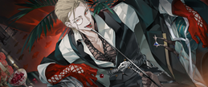
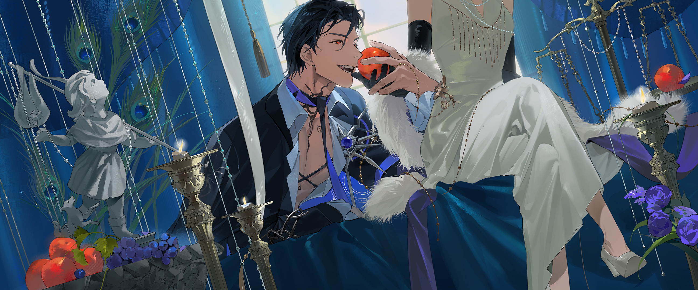
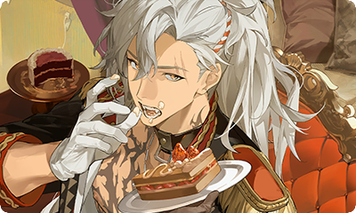
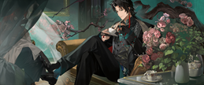

# Tier List

## Early Game

Ratings compare Styles within their role only.

**Recommended structure:** Vanguard + ST DPS + AoE DPS + Support + Healer

  

  
Vanguard

  
ST DPS

  
AoE DPS

  
Support

  
Healer

  
T0

  

    
  

  

    
  

  

    
  

  

    
  

  

    
  

