# Tier List

## Early Game

Ratings compare Styles within their role only.

**Recommended structure:** Vanguard + ST DPS + AoE DPS + Support + Healer

  <!-- =========================
       Headers
       ========================= -->

  

  

    
    Vanguard
  

  

    
    ST DPS
  

  

    
    AoE DPS
  

  

    
    Support
  

  

    
    Healer
  

  <!-- =========================
       T0
       ========================= -->

  
T0

  <!-- Vanguard -->
  

    <a
      class="style-card rarity-6"
      href="../styles/red-gloves-abyssal-judgment/"
      title="Red Gloves — Abyssal Judgment"
    >
      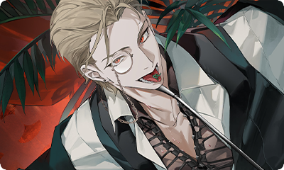
      

        
      

      
Red Gloves

      

    </a>
  

  <!-- ST DPS -->
  

    <a
      class="style-card rarity-6"
      href="../styles/fool-card-table-seer/"
      title="Fool — Card Table Seer"
    >
      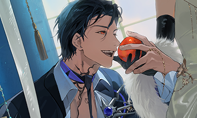
      

        
      

      
Fool

      

    </a>
  

  <!-- AoE DPS -->
  

    <a
      class="style-card rarity-6"
      href="../styles/wolf-patrol-guard/"
      title="Wolf — Patrol Guard"
    >
      
      

        
      

      
Wolf

      

    </a>
  

  <!-- Support -->
  

    <a
      class="style-card rarity-6"
      href="../styles/general-thunder-commander/"
      title="General — Thunder Commander"
    >
      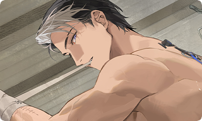
      

        
      

      
General

      

    </a>
  

  <!-- Healer -->
  

    <a
      class="style-card rarity-6"
      href="../styles/windward-money-loving-gentleman/"
      title="Windward — Money-Loving Gentleman"
    >
      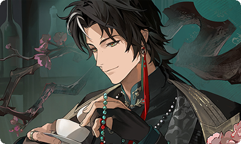
      

        
      

      
Windward

      

    </a>
  

  <!-- =========================
       T1
       ========================= -->

  
T1

  <!-- Vanguard -->
  

    <a
      class="style-card rarity-6"
      href="../styles/tyrant-lord-of-terra/"
      title="Tyrant — Lord of Terra"
    >
      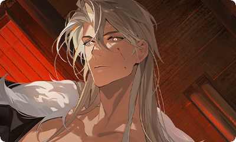
      

        
      

      
Tyrant

      

    </a>
  

  <!-- ST DPS -->
  

<!-- ST DPS -->

  {{ style_card("lodestar-sea-rover") }}

  

  <!-- AoE DPS -->
  

    <a
      class="style-card rarity-6"
      href="../styles/ghost-vengeful-nursery-rhyme/"
      title="Ghost — Vengeful Nursery Rhyme"
    >
      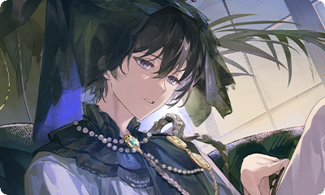
      

        
      

      
Ghost

      

    </a>
  

  <!-- Support -->
  

    <a
      class="style-card rarity-6"
      href="../styles/ng-dream-producer/"
      title="NG — Dream Producer"
    >
      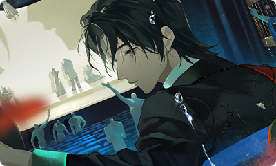
      

        
      

      
NG

      

    </a>
  

  <!-- Healer -->
  

    <a
      class="style-card rarity-6"
      href="../styles/rainmaker-world-cleansing-rain/"
      title="Rainmaker — World-Cleansing Rain"
    >
      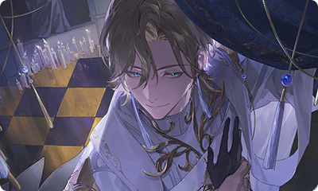
      

        
      

      
Rainmaker

      

    </a>
  

  <!-- =========================
       T2
       ========================= -->

  
T2

  <!-- Vanguard -->
  

    <a
      class="style-card rarity-5"
      href="../styles/red-gloves-ace-lawyer/"
      title="Red Gloves — Ace Lawyer"
    >
      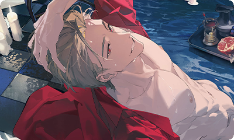
      

        
      

      
Red Gloves

      

    </a>
  

  <!-- ST DPS -->
  

    <a
      class="style-card rarity-5"
      href="../styles/chef-veteran-butcher/"
      title="Chef — Veteran Butcher"
    >
      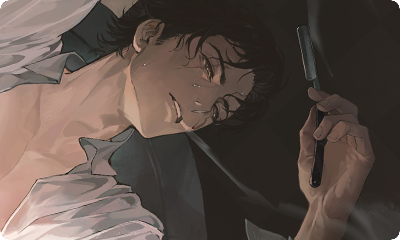
      

        
      

      
Chef

      

    </a>
  

  <!-- AoE DPS -->
  

    <a
      class="style-card rarity-5"
      href="../styles/nobody-seaside-holiday/"
      title="Nobody — Seaside Holiday"
    >
      
      

        
      

      
Nobody

      

    </a>
  

  <!-- Support -->
  

    <a
      class="style-card rarity-6"
      href="../styles/headmistress-scorching-sands-knight/"
      title="Headmistress — Scorching Sands Knight"
    >
      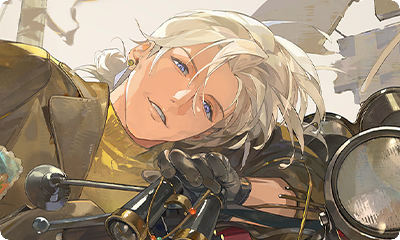
      

        
      

      
Headmistress

      

    </a>

    <a
      class="style-card rarity-5"
      href="../styles/gift-player-in-the-play/"
      title="Gift — Player in the Play"
    >
      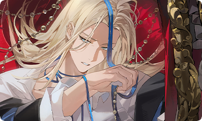
      

        
      

      
Gift

      

    </a>

  

  <!-- Healer -->
  

    <a
      class="style-card rarity-5"
      href="../styles/laksa-spice-merchant/"
      title="Laksa — Spice Merchant"
    >
      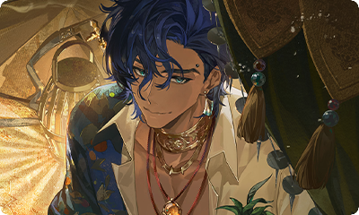
      

        
      

      
Laksa

      

    </a>
  

  <!-- =========================
       T3
       ========================= -->

  
T3

  <!-- Vanguard -->
  

  <!-- ST DPS -->
  

  <!-- AoE DPS -->
  

    <a
      class="style-card rarity-6"
      href="../styles/manipulator-technology-minister/"
      title="Manipulator — Technology Minister"
    >
      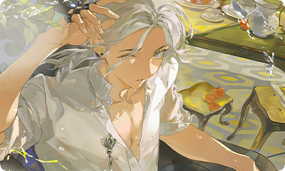
      

        
      

      
Manipulator

      

    </a>
  

  <!-- Support -->
  

    <a
      class="style-card rarity-5"
      href="../styles/ghost-covert-investigator/"
      title="Ghost — Covert Investigator"
    >
      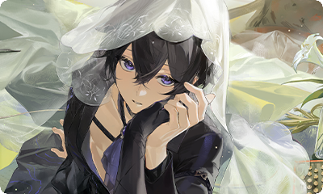
      

        
      

      
Ghost

      

    </a>

    <a
      class="style-card rarity-6"
      href="../styles/the-ref-silent-verdict/"
      title="The Ref — Silent Verdict"
    >
      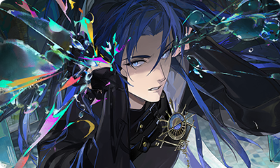
      

        
      

      
The Ref

      

    </a>

  

  <!-- Healer -->
  

